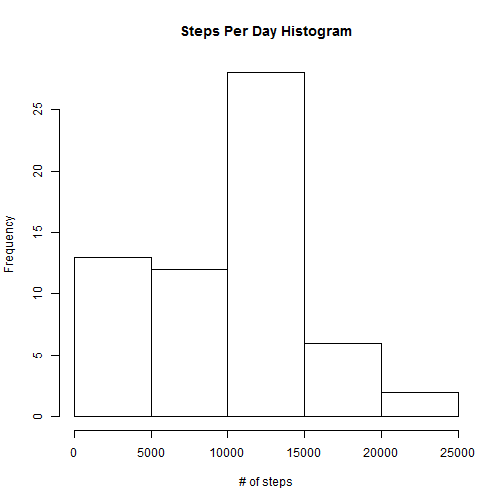
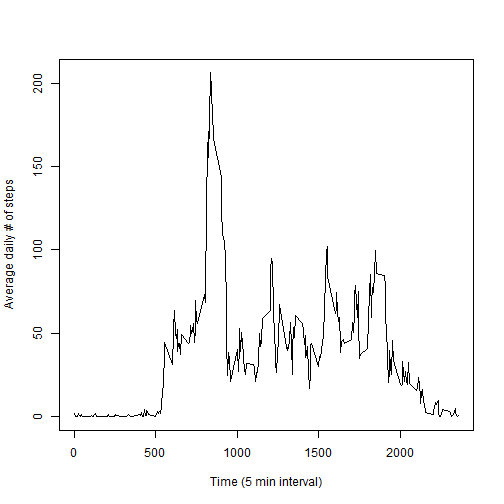
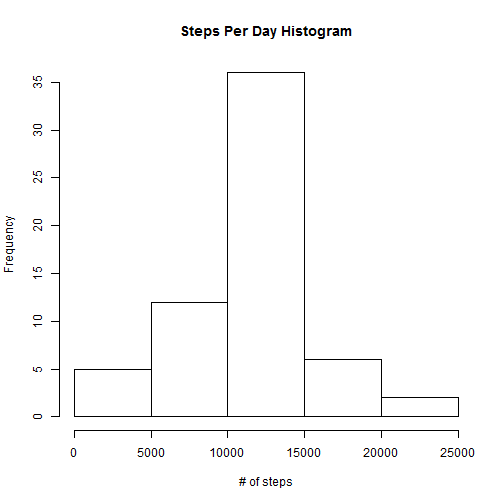
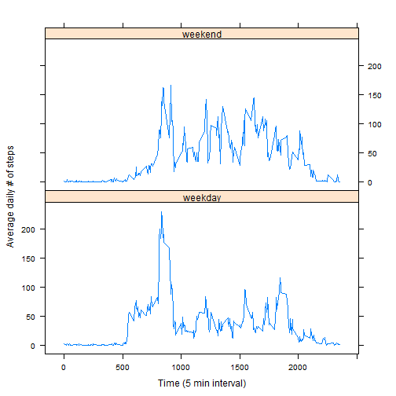

PA1_template.md
========================================================
author:Radha 
date: 7/10/2015

First Slide
========================================================

For more details on authoring R presentations click the
**Help** button on the toolbar.


- Bullet 1
- Bullet 2
- Bullet 3

Slide With Code
========================================================


```r
activity <- read.csv("activity.csv")
```

## Process data using the plyr package to summarise it for this analyis.


## Q-1: What is mean total number of steps taken per day?
## Histogram:

 
## The mean number of steaps per day is r act_mean and median is r act_median.

## Q-2: What is the average daily activity pattern?
## Time series plot:
 

## The interval that, on average, had the most # of steps was r max_interval.

## Q-3: Inputting missing values.... 
## There are r sum(is.na(activity$steps)) missing values in the data set. To ensure this does not introduce bias into summary calculations, these values will be replaced with the mean value for that 5 minute interval.

## First, merge the mean for each interval into the original data set:


##Then, using subsetting, replace the NA values with the average and update the aggregate table:


##Now, generate another histogram
 

##After replacement of the NA values, the mean number of steaps per day is r act_mean and median is r act_median.
## This has raised the mean and median number of steps per day, and also changed the histogram by increasing the number of days with more steps and decreasing the number of days with fewer steps.

##Q-4: Are there differences in activity patterns between weekdays and weekends?
## First, add a weekday factor to the data set, and summarise this:


##Now, build panel plot using the lattice package with this factor:

 
